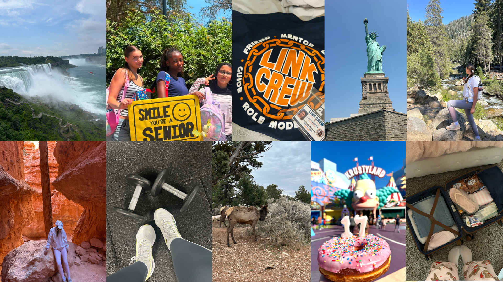

# me-in-markdown
# Marharyta

Hello! My name is **Marharyta** and I am a senior at Chatsworth Charter High School **G+STEAM Magnet**. After graduation, I plan to major in `Industrial Engineering`. Currently, I am part of the **finance/business committee in Link Crew**, helping freshmen and organizing fundraisers. This summer I was a Linked Learning Seminar Intern, giving classes to the incoming magnet freshmen and helping them adjust to the high school environment. I learned the importance of helping others and how impactful it can be.

## Hobbies

I like traveling, especially hiking. I have been to 6 National Parks.
- Yosemite
- Bryce Canyon
- Sequoia
- Death Valley
- Grand Canyon
- Zion. 

This summer I traveled to **New York City and Niagara Falls State Park**. Outside the United States, I have traveled to *Romania, Ukraine, Greece, Moldova, and France*. I also like to <u>stay active</u>. So I go to the gym <u>5 times a week</u> and I previously did *acrobatic gymnastics* for <u>5 years</u>.

## Favorite Movies
I like watching `horror and romance` movies. I have been watching horror movies since I was a kid because my sister would always put them on TV, and I would watch them with her. I have always enjoyed watching something scary. This is also why I love Halloween Horror Nights at Universal Studios, and I can’t wait to go again this year.

I started watching romance movies when I was about 14 years old. I just like how sweet they are. I also feel like I can learn something from them, like how to solve problems in relationships or how to deal with heartbreak.

|Top 3 Horror movies|Top 3 Romance Movies|
|-|-|
|Thir13en Ghosts| Your Fault
|The Platform| The Summer I Turned Pretty 
|Escape Room| Regretting You

# Spotify Playlist
1. [That's What I Like by Bruno Mars](https://open.spotify.com/track/0KKkJNfGyhkQ5aFogxQAPU?si=4707d94949ab4673)

2. [Malcolm In The Middle by Malcolm Todd](https://open.spotify.com/track/6fLWI86qpzbxvAQO90tiwR?si=58ca2f2f3fec4cf1)

3. [Cupid's Chokehold / Breakfast in America by Gym Class Heroes](https://open.spotify.com/track/2Lhdl74nwwVGOE2Gv35QuK?si=32eef33d1c4f489c)

4. [Hex by 80purppp](https://open.spotify.com/track/7D7e6hm2LiNd6nLuJF6K9Q?si=fdde79d6fb2e4222)

5. [There's Nothing Holdin' Me Back by Shawn Mendes](https://open.spotify.com/track/7JJmb5XwzOO8jgpou264Ml?si=a0caa1bade434187)

6. [Roommates by Malcolm Todd](https://open.spotify.com/track/5vPUv0xziXbV4lnWeVNXNq?si=76743e55efb748f0)

7. [Baby by Justin Bieber, Ludacris](https://open.spotify.com/track/6epn3r7S14KUqlReYr77hA?si=582c7b49ca5648d6)

8. [Earrings by Malcolm Todd](https://open.spotify.com/track/0eAuGrXyGFYwur9ARUe7LJ?si=74f9697901af4cb8)

9. [Hey There Delilah by Plain White T's](https://open.spotify.com/track/4RCWB3V8V0dignt99LZ8vH?si=c130fa06830a4c53)

10. [Anyone Else But You by The Moldy Peaches](https://open.spotify.com/track/2pKi1lRvXNASy7ybeQIDTy?si=6c53e96c3638497c)

# Collage
